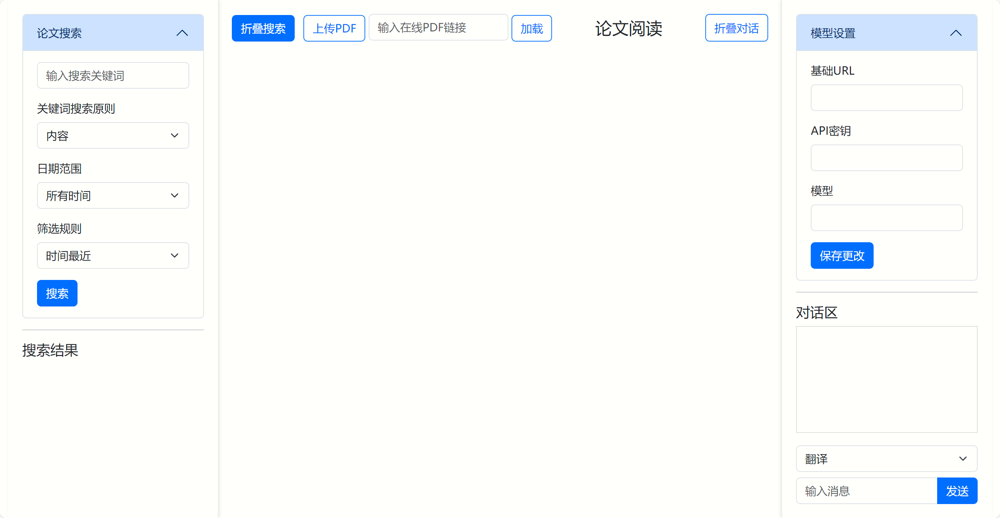

# 论文助手应用

## 项目概述

这是一个基于Flask的Web应用，旨在帮助用户搜索arXiv上的学术论文，并提供翻译、总结、解释和多轮对话功能。应用集成了语言模型服务（通过LangChain实现），能够处理学术文本并生成高质量的中文输出。

### 功能

1. **论文搜索**：
   - 通过关键词、类别和时间范围搜索arXiv论文。
   - 支持按相关性或提交日期排序。

2. **文本处理**：
   - **翻译**：将英文论文段落翻译为中文，保持学术规范和准确性。
   - **总结**：提取论文段落的核心内容，生成简洁摘要。
   - **解释**：详细分析论文段落，提供逐句解释和术语说明。

3. **多轮对话**：
   - 支持与AI助手的连续对话，保留上下文。
   - 可清空对话历史。

4. **模型配置**：
   - 通过API动态调整语言模型的设置（URL、API密钥、模型名称）。

5. **本地pdf上传**:
   - 可以上传本地pdf进行辅助阅读。

6. **自定义在线pdf**：
   - 可以输入自定义的在线pdf链接进行辅助阅读。

## 安装方法

### 前提条件

- Python 3.9 或更高版本
- pip 包管理器

### 步骤

1. 安装依赖（建议使用conda虚拟环境）
    ```
    pip install -r requirements.txt
    ```
2. 运行程序
    ```
    python app.py
    ```
    
    - 应用将在 http://0.0.0.0:5000 启动，开启调试模式。
    - 在浏览器中打开 http://localhost:5000 查看前端界面。

### UI


### TODO

1. 将论文作为大模型知识库，进行检索增强生成。
2. 划词翻译。
3. 适配谷歌搜索。